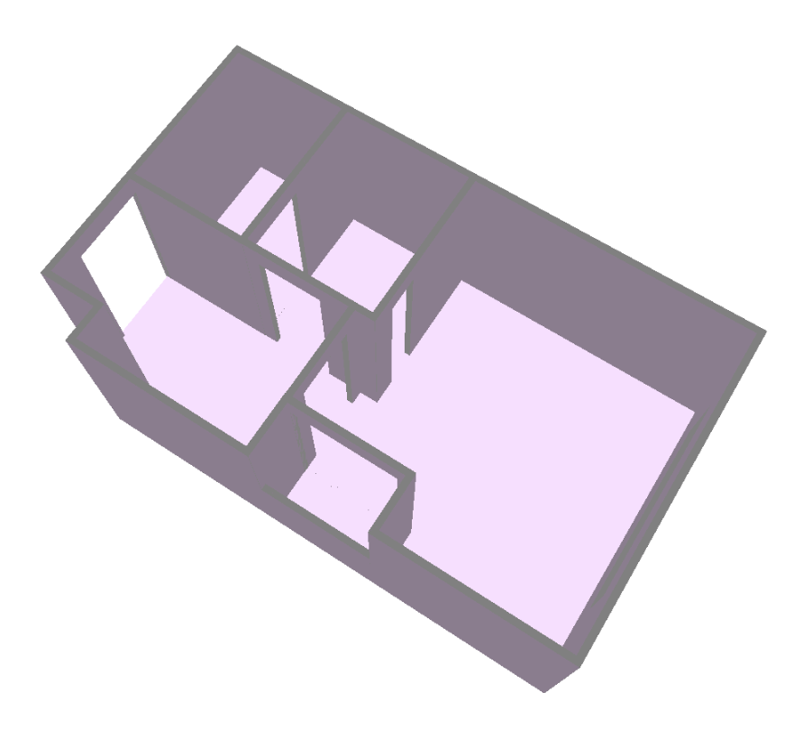
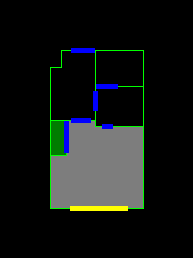

# R2V-to-Plan2Scene
Generate [Plan2Scene](https://github.com/3dlg-hcvc/plan2scene/) compatible scene.json files from [raster-to-vector](https://github.com/art-programmer/FloorplanTransformation) outputs.

## Dependencies
```bash
pip install -r requirements.txt
```

## Converting R2V output to Plan2Scene scene.json format
To convert a raster-to-vector output to the scene.json format, run the following command.
```bash
export PYTHONPATH=./code/src
python convert.py [Output path] [Path to raster-to-vector output file] --scale-factor [Scale factor] --scene-defaults scene_defaults.json --r2v-labels-path sample_input/r2v_labels.json  

# The scale factor is used to convert pixel coordinates provided by raster-to-vector into meters.

# Example
python convert.py ./outputs/ ./sample_input/sample_r2v_output.txt --scale-factor 0.08
```

The outputs directory has the following files:
 - *.scene.json file describing the house architecture.
 - *.objectaabb.json file describing axis aligned bounding boxes of object icons.
 - Sketches of floorplan and the rooms. Use these for debugging purposes.

## Previewing results
1) To preview the *.scene.json file with house architecture in 3D, use the scene-viewer of [SmartScenesToolkit](https://github.com/smartscenes/sstk).

    

2) We generate 2D sketches that preview the annotations. Use these to identify errors in the parsed floorplan such as missing room-door-room edges.

    The following generated sketch shows room 4 of the provided sample house.

    

    The focused room (room4) is colored green. Its door connected neighbors are gray colored. The doors are indicated by blue lines and windows are indicated by yellow lines.

## Using Plan2Scene with R2V outputs
Please refer to the intructions provided in the Plan2Scene code repository.
    
## Configurations of R2V-to-Plan2Scene tool
In this section, we describe different configurations that you may want to change.
 - Update [room_types.json file](./conf/r2v_importer/room_types.json) with the room type labels predicted by raster-to-vector. Make sure the labels are correctly ordered.
 - Configurations used to generate scene.json files are available in the [arch_defaults.json file](./conf/r2v_importer/arch_defaults.json).
 - Configurations used to parse raster-to-vector outputs are available in the [parser_config.json file](./conf/r2v_importer/parser_config.json)
